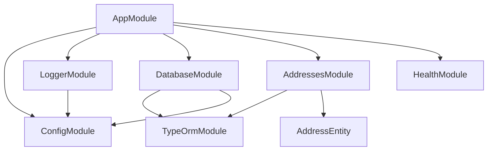
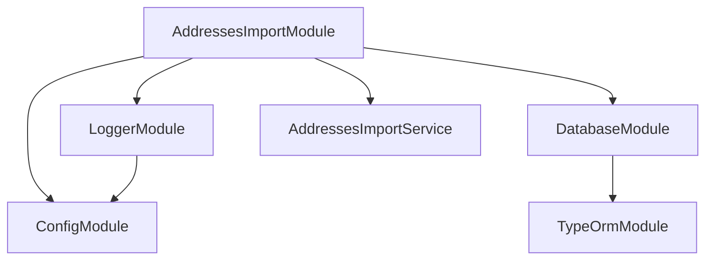

<- [Содержание](../../README.md)

---

# Архитектура: карта модулей

Документ фиксирует NestJS модули и их зависимости. В проекте есть два контекста: HTTP приложение и CLI импорт.

## HTTP приложение

### Модули и назначение

**AppModule**
- Корневой модуль HTTP-приложения.
- Подключает конфигурацию, логирование, БД и доменные модули.
- Регистрирует `HttpExceptionFilter` как глобальный провайдер.

**AddressesModule**
- Поиск адресов.
- Содержит контроллер, сервис и репозиторий.

**HealthModule**
- Health endpoints (`/health`, `/health/info`, `/health/ready`).

**DatabaseModule**
- Глобальный доступ к TypeORM `DataSource`.

**LoggerModule**
- Единый логгер `AppLoggerService`.

## CLI импорт адресов

### Особенности CLI

- Поднимается через `createApplicationContext`, без HTTP сервера.
- Использует те же `ConfigModule`, `LoggerModule` и `DatabaseModule`.
- Единственный бизнес-провайдер — `AddressesImportService`.

Подробнее см. [Данные: импорт адресов](../data/addresses-import.md).
