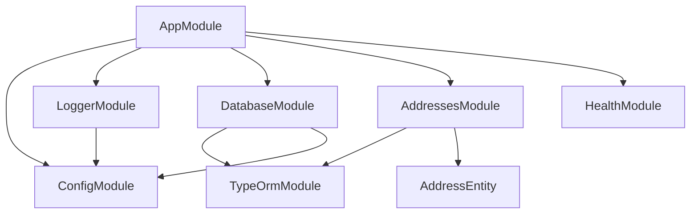

<- [Содержание](../../README.md)

---

# Архитектура: карта модулей

Документ фиксирует NestJS модули, их назначения и зависимости между ними.

## Карта модулей

## Модули и назначение

### AppModule

- **Назначение:** корневой модуль приложения.
- **Импорты:** `ConfigModule`, `LoggerModule`, `DatabaseModule`, `AddressesModule`, `HealthModule`.
- **Провайдеры:** `HttpExceptionFilter` как глобальный фильтр.

### AddressesModule

- **Назначение:** поиск адресов.
- **Контроллеры:** `AddressesController`.
- **Провайдеры:** `AddressesService`, `AddressesRepository`.
- **Импорты:** `TypeOrmModule.forFeature([AddressEntity])`.

### HealthModule

- **Назначение:** liveness/info/readiness проверки.
- **Контроллеры:** `HealthController`.
- **Провайдеры:** `HealthService`.

### DatabaseModule

- **Назначение:** глобальный доступ к `DataSource` через TypeORM.
- **Особенности:** конфигурация берётся из `ConfigService`.

### LoggerModule

- **Назначение:** глобальный логгер, использующий `ConsoleLogger` и request-id.
