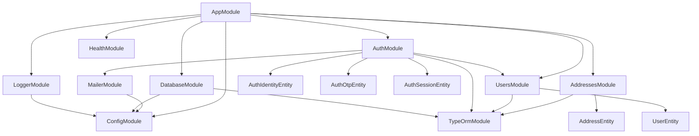
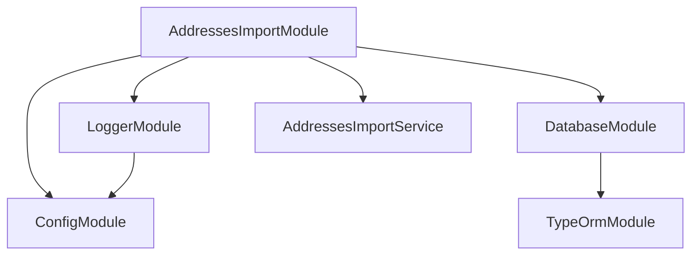

<- [Содержание](../../README.md)

---

# Архитектура: карта модулей

Документ фиксирует NestJS модули и их зависимости. В проекте есть два контекста: HTTP приложение и CLI импорт.

## HTTP приложение

### Модули и назначение

**AppModule**
- Корневой модуль HTTP-приложения.
- Подключает конфигурацию, логирование, БД и доменные модули.
- Регистрирует `HttpExceptionFilter` как провайдер (глобально подключается в `src/main.ts`).

**AddressesModule**
- Поиск адресов.
- Содержит контроллер, сервис и репозиторий.

**UsersModule**
- Пользователи и их профильные данные.
- Содержит сервис и репозиторий.

**AuthModule**
- Идентификаторы входа, OTP и сессии.
- Содержит сервис и репозитории.
- Использует `UsersModule` и `MailerModule`.

**MailerModule**
- Отправка email (SMTP).
- Используется модулем Auth.

**HealthModule**
- Health endpoints (`/health`, `/health/info`, `/health/ready`).

**DatabaseModule**
- Глобальный доступ к TypeORM `DataSource`.

**LoggerModule**
- Единый логгер `AppLoggerService`.

## CLI импорт адресов

### Особенности CLI

- Поднимается через `createApplicationContext`, без HTTP сервера.
- Использует те же `ConfigModule`, `LoggerModule` и `DatabaseModule`.
- Единственный бизнес-провайдер — `AddressesImportService`.

Подробнее см. [Данные: импорт адресов](../data/addresses-import.md).
