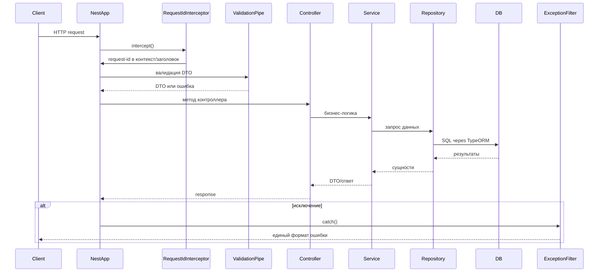

<- [Содержание](../../README.md)

---

# Архитектура: жизненный цикл запроса

Документ описывает путь HTTP-запроса внутри NestJS приложения, включая глобальные перехватчики и фильтры.

## Последовательность

## Глобальные компоненты

- **ValidationPipe**: `whitelist`, `transform`, `forbidNonWhitelisted`.
- **HttpExceptionFilter**: единый JSON-ответ и логирование.
- **RequestIdInterceptor**: заголовок `x-request-id` и AsyncLocalStorage контекст.
