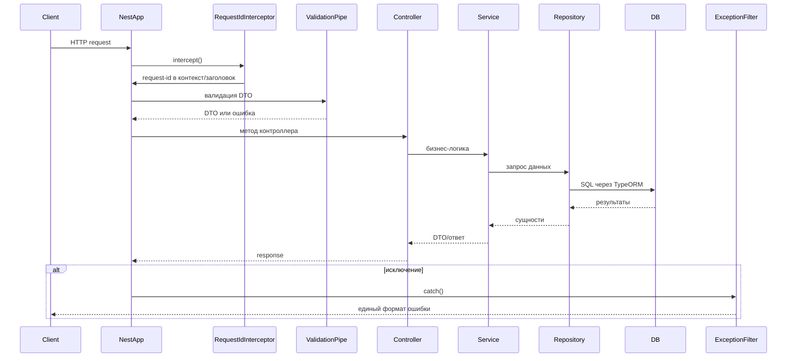

<- [Содержание](../../README.md)

---

# Архитектура: жизненный цикл запроса

Документ описывает путь HTTP-запроса внутри NestJS приложения, включая глобальные пайпы, фильтры и интерсепторы.

## Последовательность

## Глобальные компоненты

**RequestIdInterceptor**
- Читает заголовок `x-request-id`, либо генерирует новый UUID.
- Добавляет `x-request-id` в ответ.
- Хранит идентификатор в `AsyncLocalStorage`, чтобы он попадал в логи.

**ValidationPipe**
- `whitelist: true` — удаляет неизвестные поля.
- `forbidNonWhitelisted: true` — ошибка при наличии лишних полей.
- `transform: true` — приводит типы (например, `limit` к числу).

**HttpExceptionFilter**
- Приводит ошибки к единому формату JSON.
- Логирует 4xx как `warn`, 5xx как `error`.

## Где настраивается

Глобальные пайпы/фильтры/интерсепторы подключаются в `src/main.ts` в функции `setupApp`.

Формат ошибок и контракт API описаны в [API: обзор](../api/overview.md).
