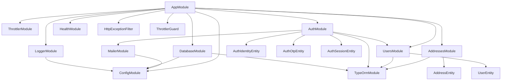
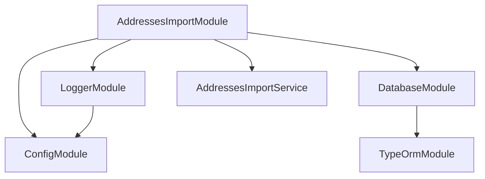

<- [Содержание](../../README.md)

---

# Архитектура: карта модулей
Owner: Backend Team
Last reviewed: 2026-02-04

## Цель
Зафиксировать NestJS модули и их зависимости.

## Контекст
В проекте есть два контекста: HTTP приложение и CLI импорт.

## Шаги
1. Найдите нужный контекст (HTTP или CLI).
2. Используйте диаграмму для навигации по модулям.

## HTTP приложение

### Модули и назначение
**AppModule**
- Корневой модуль HTTP-приложения.
- Подключает конфигурацию, логирование, БД и доменные модули.
- Регистрирует `HttpExceptionFilter` и глобальный `ThrottlerGuard`.

**AddressesModule**
- Поиск адресов.
- Содержит контроллер, сервис и репозиторий.

**UsersModule**
- Пользователи и их профильные данные.
- Содержит сервис и репозиторий.

**AuthModule**
- Идентификаторы входа, OTP и сессии.
- Содержит сервис и репозитории.
- Использует `UsersModule` и `MailerModule`.

**MailerModule**
- Отправка email (SMTP).
- Используется модулем Auth.

**HealthModule**
- Health endpoints (`/health`, `/health/info`, `/health/ready`).

**DatabaseModule**
- Глобальный доступ к TypeORM `DataSource`.

**LoggerModule**
- Единый логгер `AppLoggerService`.

**ThrottlerModule**
- Глобальный rate limiting.

## CLI импорт адресов

### Особенности CLI
- Поднимается через `createApplicationContext`, без HTTP сервера.
- Использует те же `ConfigModule`, `LoggerModule` и `DatabaseModule`.
- Единственный бизнес-провайдер — `AddressesImportService`.

## Ограничения
Диаграмма отражает текущую структуру и должна обновляться при добавлении новых модулей.

## См. также
- [Архитектура: обзор](overview.md)
- [Архитектура: жизненный цикл запроса](request-lifecycle.md)
