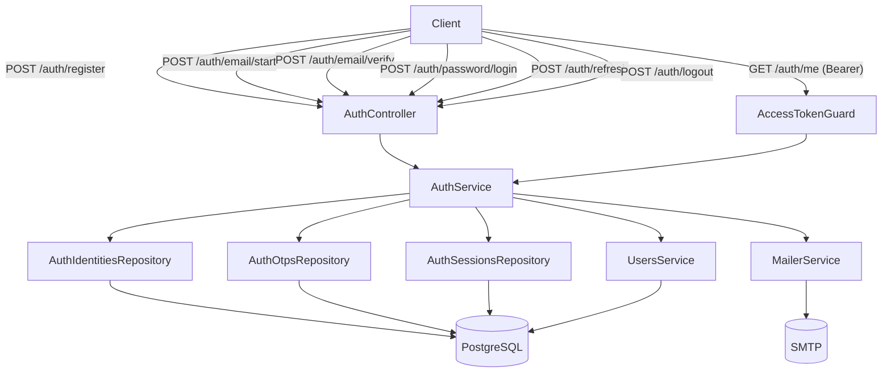
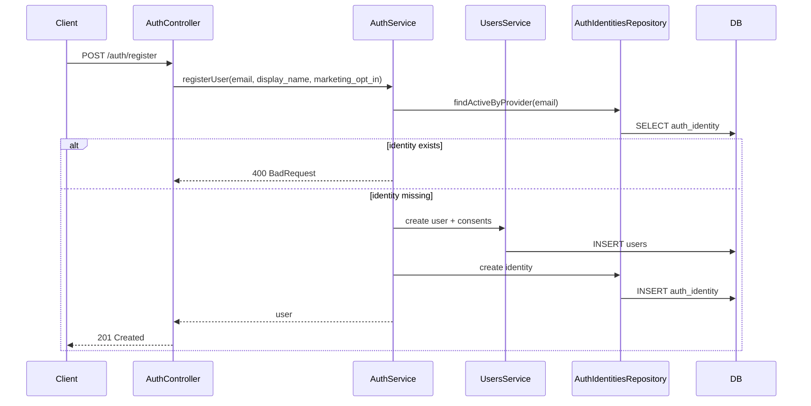
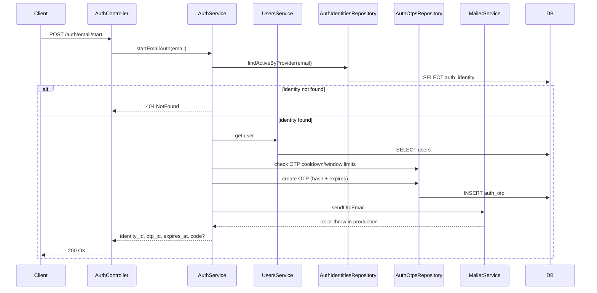
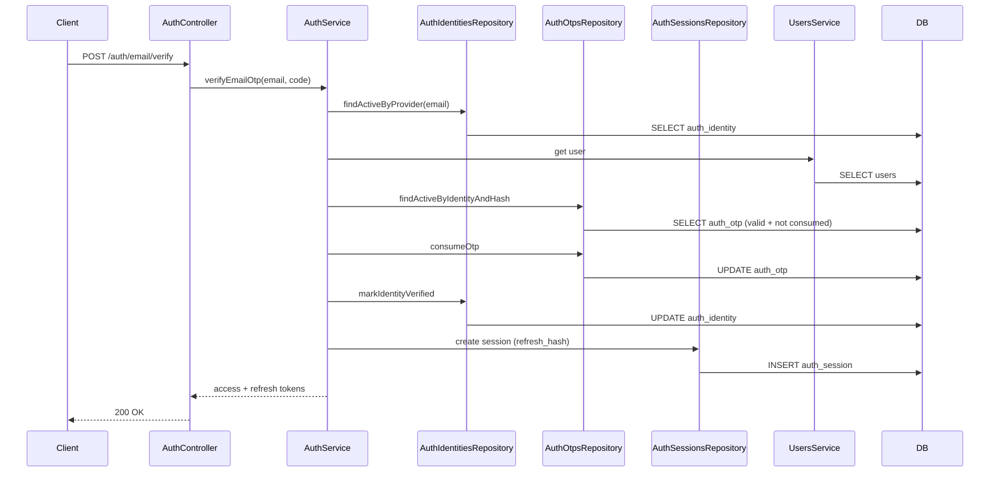
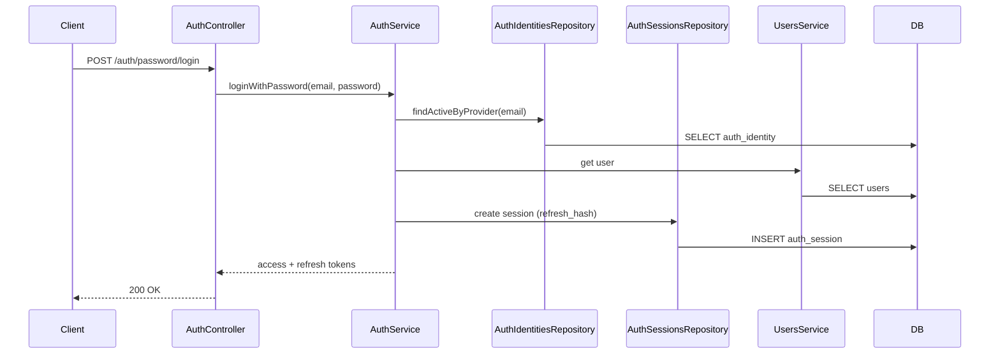
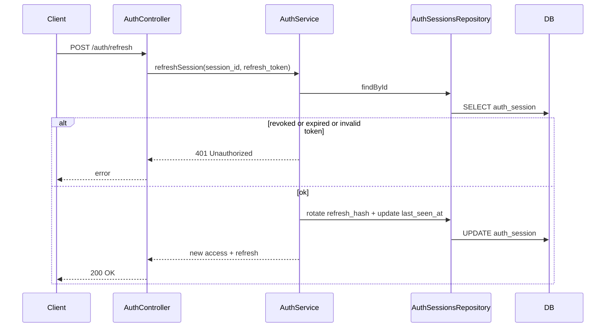
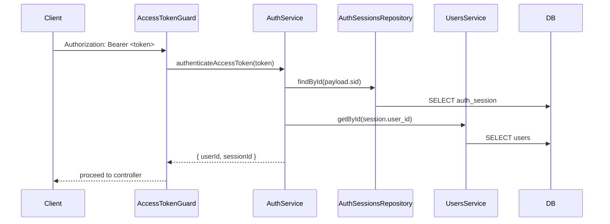

<- [Содержание](../../README.md)

---

# Безопасность: аутентификация
Owner: Security Team
Last reviewed: 2026-02-04

## Цель
Зафиксировать текущий механизм аутентификации и потоки входа.

## Контекст
Используются вход по email + OTP, вход по паролю, access/refresh токены и проверка сессий.

## Шаги
1. Ознакомьтесь с текущим статусом и ограничениями.
2. Используйте схемы для понимания потоков.
3. При изменениях обновляйте этот документ и API-эндпоинты.

## Текущее состояние
- Реализованы эндпоинты `/auth/*` (register, email + OTP, password login, refresh, logout, `/auth/me`).
- В `/auth/register` пароль передаётся опционально и сохраняется в `auth_identity`.
- Access-токены (`Bearer`) используются для `/auth/me` и `/auth/logout`.
- Refresh-токены хранятся как хэш в `auth_session`.
- Пароли хранятся как `scrypt`-хэш с солью в `auth_identity.password_hash`.
- Доменные таблицы и сервисы для identity/OTP/сессий добавлены.
- Остальные эндпоинты публичны.
- В non-production OTP возвращается в ответе; если SMTP не настроен, код логируется и письмо не отправляется.
- В production требуется SMTP (минимум `MAILER_HOST`, `MAILER_PORT`, `MAILER_FROM`). Если он не настроен, `/auth/email/start` завершится ошибкой.
- Запросы OTP ограничены по частоте (`AUTH_OTP_COOLDOWN_SECONDS`) и по количеству в окне (`AUTH_OTP_WINDOW_SECONDS` + `AUTH_OTP_MAX_PER_WINDOW`).
- Дополнительно действует throttling на `/auth/email/start`, `/auth/email/verify`, `/auth/password/login`, `/auth/refresh`.

**Заголовок для access-токена:**

```
Authorization: Bearer <access_token>
```

## Состав модуля Auth
- `AuthController` — HTTP точки входа `/auth/*`.
- `AuthService` — бизнес-логика OTP, паролей, сессий и JWT.
- Репозитории: `AuthIdentitiesRepository`, `AuthOtpsRepository`, `AuthSessionsRepository`.
- Сущности: `AuthIdentityEntity`, `AuthOtpEntity`, `AuthSessionEntity`.
- `AccessTokenGuard` — проверяет access-токен и кладёт пользователя в `request.auth`.
- `CurrentUser` — декоратор для получения пользователя из контекста.
- `MailerService` — отправка OTP, используется только если настроен SMTP.

## Схемы

### Общее устройство



### Регистрация пользователя (`/auth/register`)



### Запрос OTP по email (`/auth/email/start`)



### Проверка OTP и выдача токенов (`/auth/email/verify`)



### Вход по паролю (`/auth/password/login`)



### Обновление refresh-сессии (`/auth/refresh`)



### Проверка access-токена (`AccessTokenGuard`)



## Потоки аутентификации (шаги)

### 1) Регистрация пользователя (`POST /auth/register`)
1. Email нормализуется (lowercase, trim).
2. Проверяется, что identity для email отсутствует.
3. Создаётся запись пользователя с `terms_accepted_at`, `privacy_accepted_at` и `marketing_opt_in`.
4. Создаётся `auth_identity` для email.
5. Если передан пароль, сохраняется его `scrypt`-хэш в `auth_identity.password_hash`.

### 2) Запрос OTP по email (`POST /auth/email/start`)
1. Email нормализуется.
2. Если identity не найдена — возвращается `NotFound`.
3. Создаётся OTP, код хэшируется (SHA-256) и сохраняется в `auth_otp`.
4. Код отправляется через SMTP, либо логируется в non-production.
5. В ответ возвращаются `identity_id`, `otp_id`, `expires_at` и `code` (только non-production).

Перед созданием OTP применяется лимит:
- `AUTH_OTP_COOLDOWN_SECONDS` — минимальный интервал между выдачами.
- `AUTH_OTP_WINDOW_SECONDS` + `AUTH_OTP_MAX_PER_WINDOW` — максимум выдач в окне.

### 3) Проверка OTP (`POST /auth/email/verify`)
1. Проверяется длина кода (`AUTH_OTP_LENGTH`).
2. Ищется активный OTP по `identity_id`, хэшу и `expires_at`.
3. OTP помечается как использованный (`consumed_at`).
4. Identity помечается как верифицированный.
5. Создаётся refresh-сессия и выдаются access + refresh токены.

### 4) Вход по паролю (`POST /auth/password/login`)
1. Email нормализуется.
2. Ищется активный identity по email.
3. Проверяется хэш пароля (`auth_identity.password_hash`).
4. Пользователь проверяется на архивирование.
5. Создаётся refresh-сессия и выдаются access + refresh токены.

### 5) Обновление сессии (`POST /auth/refresh`)
1. Проверяется наличие сессии и отсутствие `revoked_at`.
2. Проверяется срок жизни refresh-сессии (`AUTH_REFRESH_TTL_SECONDS`, считается от `created_at`).
3. Проверяется хэш refresh-токена.
4. Refresh-токен ротируется (создаётся новый), `last_seen_at` обновляется.
5. Возвращается новый access + refresh токен.

### 6) Выход (`POST /auth/logout`)
1. Требуется `Bearer` access-токен.
2. `session_id` должен совпадать с сессией в access-токене.
3. Сессия помечается как отозванная (`revoked_at`).
4. Возвращается `revoked_at`.

### 7) Профиль пользователя (`GET /auth/me`)
1. `AccessTokenGuard` валидирует JWT и проверяет сессию.
2. Пользователь извлекается из `request.auth`.
3. Возвращается `User`.

## Токены и хранение секретов
- Access-токен — JWT с payload `{ sub, sid }`, TTL = `AUTH_ACCESS_TTL_SECONDS`.
- Refresh-токен — случайная строка (hex), хранится только как SHA-256 хэш.
- OTP — цифровая строка длиной `AUTH_OTP_LENGTH`, хранится как SHA-256 хэш.
- Пароль — хранится как `scrypt`-хэш с солью в `auth_identity.password_hash`.

## Проверки при доступе
- Access-токен должен быть валиден и подписан `AUTH_JWT_SECRET`.
- Сессия должна существовать, не быть отозванной и не быть просроченной по refresh TTL.
- Пользователь должен существовать и не быть архивированным.

## Точки расширения
Если потребуется защищать остальные эндпоинты, рекомендуемые точки интеграции:
- Глобальный Guard или Guard на контроллерах.
- Стратегии через `@nestjs/passport` (JWT, API Key и т.д.).
- Контекст пользователя в `Request` и логирование `request-id`.

После добавления аутентификации обновите:
- [API: обзор](../api/overview.md)
- [Безопасность: авторизация/RBAC](authorization-rbac.md)
- [Траблшутинг](../../ops/troubleshooting.md)

## Ограничения
Документ описывает текущую реализацию email-OTP и вход по паролю. Другие провайдеры не поддерживаются.

## См. также
- [API: эндпоинты](../api/endpoints.md)
- [Переменные окружения](../configuration/environment-variables.md)
